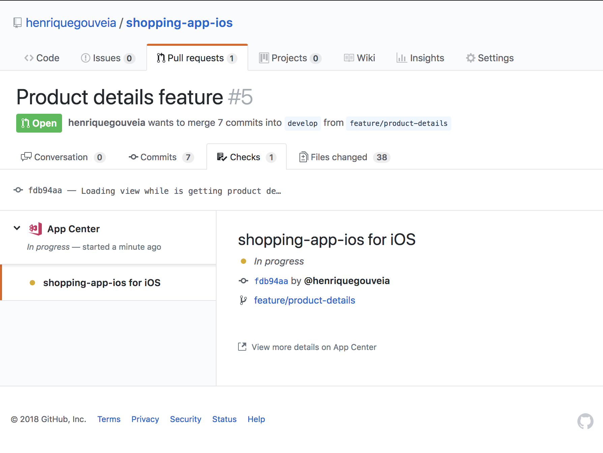

# Shopping-app-ios

### The Architecture

### CI

The AppCenter was used to garantee the consistency of the product executing the build process and unit tests on every push.

You can check this out accessing the [AppCenter](https://appcenter.ms/users/hgouveia/apps/shopping-app-ios/build/branches/develop/) with these credentials

* **username**: gouveia.henriq@gmail.com
* **password**: Support;123

### What is Missing

* Do the bind of the loading view to be shown on Product List while it is getting the data
* The infinite scroll on product list to load the other pages
* The recommendations section
* UITest scenario 
